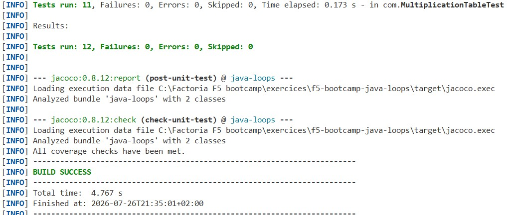
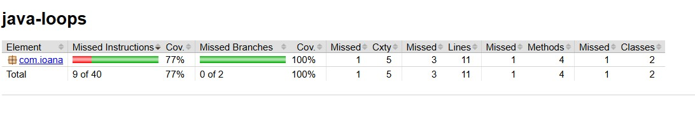
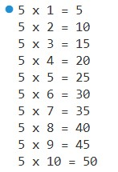

# Loops

This project is part of the Factoría F5 bootcamp. 

The goal of the **Loops** exercise is to implement a Java class that generates the multiplication table of a given number `n`

## 📌 Requirements

- Implement a class that generates the multiplication table for a given integer `n`, return its multiplication table (from 1 to 10)
- Each multiple n * i (where 1 <= i <= 10) must be printed on a new line in the format: n x i = result 
- The class must be fully tested
- Minimum **70% test coverage** is required

Example: given n = 5

Output:

```text
5 x 1 = 5
5 x 2 = 10
5 x 3 = 15
5 x 4 = 20
5 x 5 = 25
5 x 6 = 30
5 x 7 = 35
5 x 8 = 40
5 x 9 = 45
5 x 10 = 50
```


## 📦 Deliverables

**Unit tests**



**Test coverage report**



**Application output**



